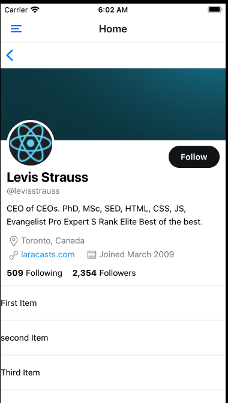
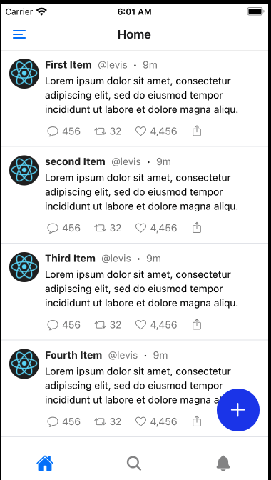
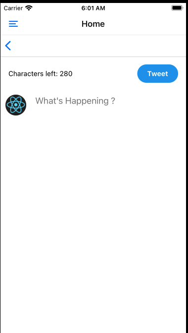

This is an example of twitter app built with react native 

............TODO...............

All the configuration can be found in the package.json file.
Make sure to keep the exact content of the babel.config.js file.
Follow the installation of IOS and Android simulator in the expo website for guidance.

NB: the app is still in development mode

-----------Here are some of the screens done------------

